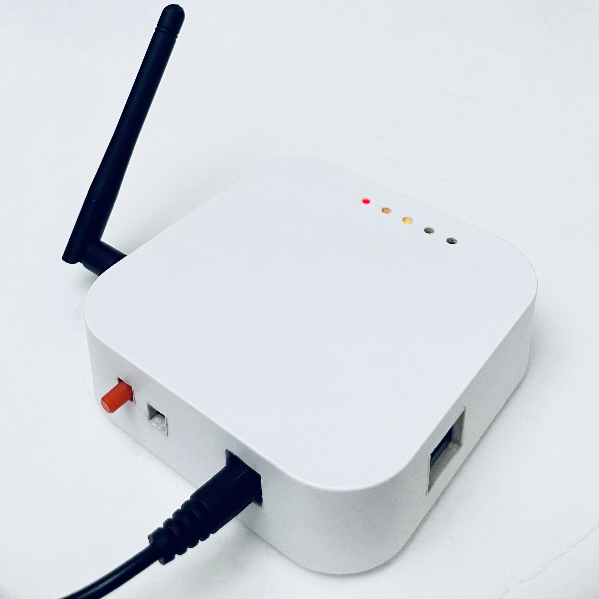
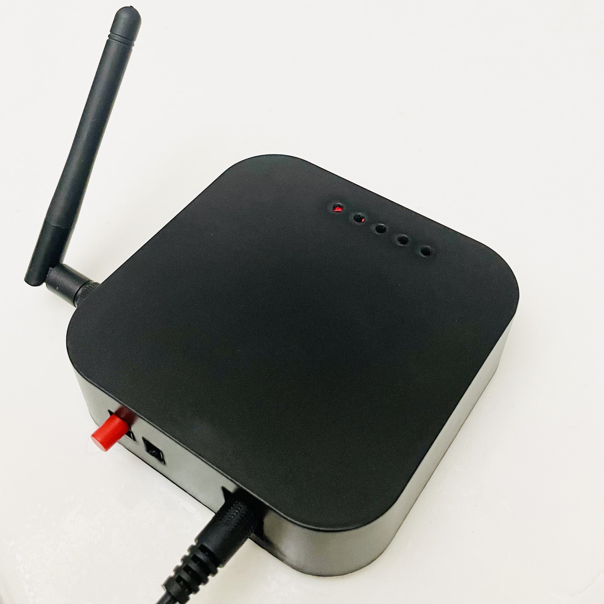
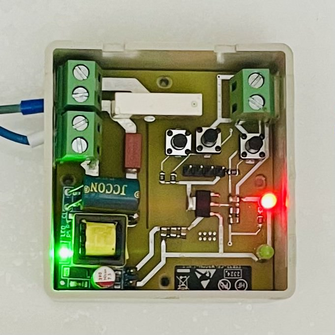
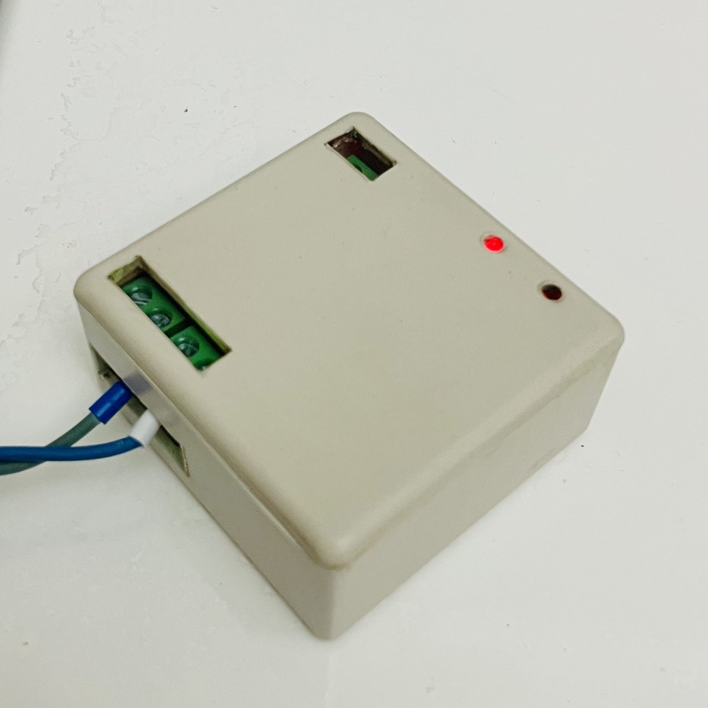

# Smart-Home-Zigbee-Platform 🏠

**A comprehensive, cost-effective, and scalable solution for residential automation using the Zigbee protocol.**

## 📖 Project Overview
This project addresses common challenges in smart home development, such as power consumption, network coverage, and device integration. We have designed a complete system based on the Zigbee protocol that includes custom hardware and software integration.

Key capabilities include:
* **Universal Compatibility:** Capable of adding any Zigbee device from any brand to the network.
* **Automatic Device Discovery:** Seamless integration of new nodes.
* **Real-time Control:** Instant feedback and command execution via a remote platform.
* **Extended Network Coverage:** Robust signal stability using custom router nodes.
* **High Scalability:** Designed to support a large number of devices in a mesh network.

## 🏗️ System Architecture
The platform consists of three main components:

1.  **Zigbee Hub (Central Node)** 🧠
    * **Hardware:** A **custom-designed PCB** hosting an **Orange Pi Zero 3**. It integrates the Zigbee module and power management to act as the network coordinator.
    * **Software:** Runs **Zigbee2MQTT** to bridge Zigbee traffic to the MQTT protocol, transmitting data to **ThingsBoard** for monitoring and control.

2.  **Zigbee Router (Repeater)** 📡
    * **Function:** Enhances network coverage and signal stability by relaying messages between End Devices and the Hub.
    * **Design:** A standalone custom PCB powered by a 5V adapter.

3.  **In-Wall Switch (End Device)** 💡
    * **Function:** Smart lighting control with manual override capabilities.
    * **Design:** A compact custom PCB designed to fit into standard wall switch boxes, controlling high-voltage loads via a relay.

---

# 1. Zigbee Hub (Central Node) 🧠

The Hub acts as the brain of the system, hosting the MQTT broker and bridging Zigbee communication to the ThingsBoard platform.

## ⚙️ Hardware
* **Core:** [Orange Pi Zero 3](http://www.orangepi.org/).
* **Carrier Board:** Custom-designed PCB acting as the main hub.
* **Zigbee Module:** **RF-BM-2652P4I** (based on TI CC2652P7), integrated directly onto the custom PCB.



## 💻 Software Setup

### 1. Orange Pi Setup (OS & Connectivity)
We used the **Orange Pi Zero 3** as the computational platform.

* **OS Installation:**
    1.  Download the **Debian Bookworm** image from the [Orange Pi Website](http://www.orangepi.org/html/serviceAndSupport/index.html).
    2.  Download and install [Balena Etcher](https://balena.io/etcher).
    3.  Flash the image onto a microSD card (min 8GB).
* **Initial Connection (UART):**
    * Connect a **USB-TTL converter** to the Orange Pi (TX to RX, RX to TX).
    * Open a serial terminal (e.g., [MobaXterm](https://mobaxterm.mobatek.net/)) at **115200 baud** to access the console.
* **Network & SSH:**
    * Connect to Wi-Fi:
        ```bash
        sudo nmtui
        ```
    * Get the IP address:
        ```bash
        ip a
        ```
    * Connect via SSH for easier management:
        ```bash
        ssh orangepi@<YOUR_IP_ADDRESS>
        ```

### 2. Installing Dependencies & Broker
To bridge Zigbee devices with the MQTT protocol, we need Node.js and an MQTT broker.

1.  **Install Basic Tools & Mosquitto Broker:**
    ```bash
    sudo apt update
    sudo apt install -y mosquitto mosquitto-clients git make g++ gcc
    ```
2.  **Install Node.js (Required for Z2M):**
    ```bash
    curl -fsSL [https://deb.nodesource.com/setup_20.x](https://deb.nodesource.com/setup_20.x) | sudo -E bash -
    sudo apt install -y nodejs
    ```
3.  **Verify Installation:**
    ```bash
    node -v
    npm -v
    ```

### 3. Installing Zigbee2MQTT
We followed the official [Linux Installation Guide](https://www.zigbee2mqtt.io/guide/installation/01_linux.html).

1.  **Clone the Repository:**
    ```bash
    sudo git clone [https://github.com/Koenkk/zigbee2mqtt.git](https://github.com/Koenkk/zigbee2mqtt.git) /opt/zigbee2mqtt
    sudo chown -R $USER:$USER /opt/zigbee2mqtt
    ```
2.  **Install Dependencies:**
    ```bash
    cd /opt/zigbee2mqtt
    npm ci
    ```

### 4. Configuration
Edit the configuration file to target the custom PCB's serial port and the local broker.

1.  **Open Configuration:**
    ```bash
    nano /opt/zigbee2mqtt/data/configuration.yaml
    ```
2.  **Paste Configuration:**
    ```yaml
    # MQTT Settings
    mqtt:
      base_topic: zigbee2mqtt
      server: 'mqtt://localhost'

    # Serial Settings (Custom PCB)
    serial:
      port: /dev/ttyS5       # UART5 connected to CC2652P7
      baudrate: 115200
      adapter: zstack

    # Frontend (Web Interface)
    frontend:
      enabled: true
      port: 8080
    ```
3.  **Start Zigbee2MQTT:**
    ```bash
    npm start
    ```

### 5. Flashing the Firmware (CC2652P7)
The **RF-BM-2652P4I** chip on the PCB requires the Z-Stack Coordinator firmware.

* **Firmware:** Use this [link](https://github.com/JelmerT/cc2538-bsl) to access the required firmware based on your hardware.
* **Tool:** [cc2538-bsl](https://github.com/JelmerT/cc2538-bsl).
* **Steps:**
    1.  Hold the **BOOT** button on the PCB and press **RESET** to enter bootloader mode.
    2.  Run the flashing command:
        ```bash
        python3 cc2538-bsl.py -p /dev/ttyS5 -evw coordinator_firmware.hex
        ```

### 6. ThingsBoard Integration (Cloud Bridge) ☁️
To enable remote monitoring and control, we developed a custom Python script that acts as a bridge between the local MQTT broker (Mosquitto) and the ThingsBoard Cloud platform.

#### Features
* **Telemetry Upload:** Pushes `Linkquality` and `LED` status from Zigbee2MQTT to ThingsBoard.
* **Remote Control (RPC):** Listens for `setLED` commands from ThingsBoard to toggle the In-Wall Switch.

#### Setup
1.  **Install Python Dependencies:**
    The script requires the Paho MQTT client.
    ```bash
    sudo apt install python3-pip
    pip3 install paho-mqtt
    ```

2.  **Configuration:**
    Open the python script (`/Software/Python_Bridge/bridge.py`) and update the **ThingsBoard settings**:
    ```python
    THINGSBOARD_HOST = 'tb2.thingsware.cloud'
    ACCESS_TOKEN = 'YOUR_ACCESS_TOKEN' # Replace with your actual ThingsBoard Device Token
    ```

3.  **Running the Bridge:**
    You can run the script manually for testing:
    ```bash
    python3 bridge.py
    ```

---

# 2. Zigbee Router (Repeater) 📡

The Zigbee Router is a standalone node designed to extend the range and stability of the network. It operates solely using the Zigbee module and does not require a computational board.

## ⚙️ Hardware
* **Zigbee Module:** **RF-BM-2652P4I** (TI CC2652P7).
    * Selected for its high output power (20 dBm) to maximize range.
* **Power Supply:** 5V 1A adapter with an **AMS1117-3.3** regulator.
* **Antenna:** External antenna via IPEX connector.
* **Enclosure:** Custom casing.



## 🏗️ Functionality
* **Signal Repeater:** Relays data between End Devices and the Hub.
* **Mesh Networking:** Healing and routing for network stability.

## 💻 Firmware Setup
To configure and flash the router, we use the **PTVO** tool to generate a custom firmware image, followed by `cc2538-bsl` to upload it.

### Step 1: Generate Firmware
1.  Download and install **[Zigbee Configurable Firmware (PTVO)](https://ptvo.info/)**.
2.  Open the tool and select **CC2652P7** as the target chip.
3.  Configure the device role as **Router**.
4.  (Optional) Map any status LEDs or diagnostic pins used on the custom PCB.
5.  Save/Generate the firmware file (e.g., `router_firmware.hex`).

### Step 2: Flash Firmware
1.  **Connect:** Attach the Router PCB to your PC using a **USB-TTL converter**.
2.  **Enter Boot Mode:** Hold the **BOOT** button on the PCB, press **RESET**, then release BOOT.
3.  **Flash:**
    ```bash
    python3 cc2538-bsl.py -p <YOUR_PC_COM_PORT> -evw router_firmware.hex
    ```

---

# 3. Zigbee In-Wall Switch (End Device) 💡

The In-Wall Switch is a smart end device capable of controlling AC loads (lights/appliances). It supports both wireless control via Zigbee and manual control via a physical button.

## ⚙️ Hardware
* **Chip:** **ESP32-C6** (Supports Zigbee 3.0, Wi-Fi 6, BLE 5.0).
* **Power:** **WX-DC12003** AC-DC converter (Mains to 5V) + **AMS1117-3.3**.
* **Relay:** **HF49FD** (5A, 250V AC) for load switching.
* **Safety:** Includes a slow-blow fuse (0697H1000-02) for overcurrent protection.




## 💻 Firmware Logic (C++/Arduino)
The firmware was developed using the **Arduino IDE** and the **ESP32 Zigbee SDK**. The source code is located in the `/In-Wall-Switch/Firmware` directory.

### Key Features:
1.  **Zigbee End Device:** Acts as an endpoint in the network.
2.  **Pairing Mode:** Holding the physical button for **>5 seconds** triggers factory reset and enters pairing mode (LED flashes fast).
3.  **Manual Override:** Pressing the button toggles the relay and immediately reports the new state to the Hub.
4.  **Connectivity Reporting:** Sends signal strength (`linkquality`) and state (`ON/OFF`) to the Hub.

### Flashing Instructions:
You can flash the firmware using the **Arduino IDE** or the command line tools.

1.  **Connect:** Attach the Switch PCB to your PC via USB-TTL (connected to the ESP32-C6 UART pins).
2.  **Enter Boot Mode:** Put the ESP32-C6 into bootloader mode (Hold BOOT, press RESET).
3.  **Flash via Arduino IDE:**
    * Select Board: `ESP32C6 Dev Module`.
    * Select Port: Your COM port.
    * Click **Upload**.
4.  **Flash via Command Line (esptool):**
    ```bash
    esptool.py --chip esp32c6 --port <YOUR_PORT> --baud 115200 write_flash 0x0 switch_firmware.bin
    ```
